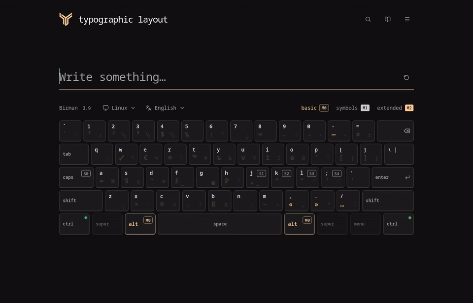

<div align="center">

<br>

<a href="https://jussiemion.github.io/keyboard-layout-demo/">
  <picture>
    <source media="(prefers-color-scheme: dark)" srcset="docs/assets/logo-dark.svg">
    <source media="(prefers-color-scheme: light)" srcset="docs/assets/logo-light.svg">
    
  </picture>
</a>

# Typographic Layout by Semyon Yushkevich

Type **“quotes”**, **— dashes**, **accénts** and **© symbols** on the keyboard
you already use.

**[Open the demo ↗](https://jussiemion.github.io/keyboard-layout-demo/)** ·
[Quick start](#quick-start) · [Languages](#languages) ·
[Run locally](#run-locally) · [Contribute](#contributing)

<p>
  <a href="https://github.com/jussiemion/keyboard-layout-demo/stargazers"></a>
  <a href="LICENSE"></a>
  <a href="#contributing"></a>
</p>

<p><strong>14 interface languages · 24 keyboard options · 3 typing modes</strong></p>

[Non-European language support is experimental](#languages).

</div>

<div align="center" dir="ltr">

<h2>Read in another language</h2>

<a href="README.md"><span dir="auto">English</span></a> ·
<a href="docs/README.ru.md"><span dir="auto">Русский</span></a> ·
<a href="docs/README.pl.md"><span dir="auto">Polski</span></a> ·
<a href="docs/README.pt.md"><span dir="auto">Português</span></a> ·
<a href="docs/README.es.md"><span dir="auto">Español</span></a> ·
<a href="docs/README.de.md"><span dir="auto">Deutsch</span></a> ·
<a href="docs/README.fr.md"><span dir="auto">Français</span></a> ·
<a href="docs/README.it.md"><span dir="auto">Italiano</span></a> ·
<a href="docs/README.nl.md"><span dir="auto">Nederlands</span></a> ·
<a href="docs/README.ro.md"><span dir="auto">Română</span></a> ·
<a href="docs/README.ar.md"><span dir="auto">العربية</span></a> ·
<a href="docs/README.he.md"><span dir="auto">עברית</span></a> ·
<a href="docs/README.tr.md"><span dir="auto">Türkçe</span></a> ·
<a href="docs/README.vi.md"><span dir="auto">Tiếng Việt</span></a>

</div>

<a href="https://jussiemion.github.io/keyboard-layout-demo/">
  <picture>
    <source media="(prefers-color-scheme: dark)" srcset="docs/assets/demo-dark.gif">
    <source media="(prefers-color-scheme: light)" srcset="docs/assets/demo-light.gif">
    
  </picture>
</a>

**Video with playback controls:** [Dark theme](docs/assets/demo-dark.mp4) ·
[Light theme](docs/assets/demo-light.mp4) · About 20 seconds each, no audio.

## A little more from every key

Typographic punctuation, accents and six language assignments, all within reach.
Explore the layout in your browser, learn one gesture at a time, and make the
language map your own.

| Type                                                                | Learn                                             | Make it yours                                                           |
| :------------------------------------------------------------------ | :------------------------------------------------ | :---------------------------------------------------------------------- |
| **“Quotes”, — dashes, © symbols** through short key sequences       | **Interactive tour** with small, guided exercises | **Six language assignments** on <kbd>Caps Lock</kbd> and its shortcuts  |
| **Accents and national characters** with language-specific gestures | **Search and cheat sheet** for a quick reminder   | **Light and dark themes**, plus Linux, Windows and macOS keyboard views |

No installation or account is needed. Practice text stays in the browser.

## Typography and accented letters at your fingertips

Typographic Layout by Semyon Yushkevich helps you write polished copy, prepare
design mockups and type across languages. Try it in your browser: no
installation or account required.

### For writers, copywriters and editors

- **Em dashes — and ellipses … without <kbd>Alt</kbd> codes.** Use short
  keyboard combinations instead of memorizing numeric codes or searching for
  symbols.
- **Quotation marks for different languages.** Type English “quotes”, French
  «guillemets» and German „quotes“ to match your editorial style.
- **Non-breaking spaces.** Keep numbers with their units and initials with their
  surnames.

### For UI/UX, web and graphic designers

- **Currency symbols $, €, £, ¥, ¢.** Prepare prices, subscription plans and
  product cards for international mockups.
- **Copyright ©, registered trademark ® and trademark ™ symbols.** Find the
  right character for interface copy, credits and presentations.
- **Searchable typography reference.** Look up a symbol, learn its purpose and
  copy it into Figma or another editor.

### For polyglots, linguists and translators

- **Type umlauts and accents with <kbd>Shift</kbd>.** Type a base letter,
  release its key, then tap <kbd>Shift</kbd> to cycle through its variants: u →
  ü in German or e → é → è → ê → ë in French.
- **National characters on your familiar keyboard.** Practise typing ä, ö, ü, é,
  è, ç, ñ and other characters supported by your selected language.
- **Explore several languages in one demo.** Assign up to six languages and
  switch between them within the page, without changing your OS input source or
  installing language packs to try the layout.

14 interface languages and 24 keyboard options, including regional variants.
Available characters and input gestures depend on the selected language. Arabic,
Hebrew, Turkish and Vietnamese support is experimental. Typing works inside the
browser demo. Copy your text into the app where you need it.

**[Try Typographic Layout by Semyon Yushkevich →](https://jussiemion.github.io/keyboard-layout-demo/en/)**

## Frequently asked questions

### How can I type special characters without <kbd>Alt</kbd> codes?

Use short keyboard combinations in Semyon Yushkevich’s layout demo.
<kbd>Alt</kbd> + minus types an em dash —, and <kbd>Alt</kbd> + / types an
ellipsis …. For the copyright symbol ©, press and release <kbd>Alt</kbd>, then
press <kbd>C</kbd>. On macOS, use <kbd>Option</kbd> instead of <kbd>Alt</kbd>.
These shortcuts use US QWERTY key positions; the reference lists input sequences
for other symbols.

### How can I type umlauts ä, ö, ü and accented letters é, è, ç quickly?

Select a keyboard language in the demo. Type a base letter, release its key,
then tap <kbd>Shift</kbd> separately. In German, use a → ä, o → ö and u → ü; in
French, use e → é → è → ê → ë and c → ç. Each <kbd>Shift</kbd> tap selects the
next variant. Available variants depend on the language.

### How does Semyon Yushkevich’s layout compare with [Birman’s](https://ilyabirman.ru/typography-layout/) for foreign languages?

For this use case, its distinctive features are cycling a previously typed
letter with <kbd>Shift</kbd> and switching between assigned languages within the
demo. These may suit frequent national-character input.
[Birman’s layout](https://ilyabirman.ru/typography-layout/) also supports
diacritics, and its symbol map forms the foundation of this project. The better
fit depends on your habits and working languages.

### How do I type euro €, copyright © or trademark ™ symbols for a design?

Search the demo by a symbol’s name or by the character itself. The reference
explains its purpose and input sequence. Copy the symbol into Figma, a text
editor or a presentation: it is inserted as an ordinary text character.

### Can I try the layout on Windows or macOS without installing it?

Yes. Open the browser demo and use your physical keyboard or click the on-screen
keys. No installation or OS language packs are needed to try it. Typing works
within the page; the demo does not change your system keyboard layout for other
applications.

## Quick start

Open the demo and type, or click the on-screen keys. No installation or account
is needed.

> [!IMPORTANT]
>
> Turn off your OS typographic layout before trying the demo: it can intercept
> <kbd>Alt</kbd> and <kbd>Caps Lock</kbd>. The demo cannot restore events the OS
> has blocked. [Details](docs/browser-adapter.md#system-layout-detection).

**Then** means press and release before the next key. **+** means hold together.
Keys below use US QWERTY positions; on macOS, <kbd>Alt</kbd> is
<kbd>Option</kbd>.

| Press                                                  | Get |   Mode   |
| ------------------------------------------------------ | :-: | :------: |
| <kbd>Alt</kbd>, then <kbd>C</kbd>                      | `©` | **`M1`** |
| <kbd>Alt</kbd>, then <kbd>Alt</kbd>, then <kbd>C</kbd> | `¢` | **`M2`** |
| <kbd>Alt</kbd> + <kbd>-</kbd>                          | `—` | **`M0`** |
| <kbd>Alt</kbd> + <kbd>/</kbd>                          | `…` | **`M0`** |
| <kbd>Alt</kbd> + <kbd>,</kbd>                          | `«` | **`M0`** |
| <kbd>Alt</kbd> + <kbd>.</kbd>                          | `»` | **`M0`** |

**`S` — Switcher**: language switcher (**`S0`–`S4`**). **`M` — Modifier**:
typing-mode modifier (**`M0`–`M2`**).

**`M0`** is ordinary typing. **`M1`** and **`M2`** select a symbol layer for the
next input. There is no time limit between taps. <kbd>Esc</kbd> cancels a
pending symbol or accent.

> [!TIP]
>
> Start **Menu → Guided tour** for short exercises. Already know
> [Birman’s layout](https://ilyabirman.ru/typography-layout/)? Skip its
> introduction. The book button opens the cheat sheet at any time.

## Accents and language switching

Type a letter, release it, then tap <kbd>Shift</kbd> to cycle its variants:
Polish `a → ą → a`, German `u → ü → u`. Holding <kbd>Shift</kbd> with a letter
still produces its normal uppercase/shifted form.

For an acute accent, tap <kbd>Alt</kbd>, <kbd>Alt</kbd>, <kbd>/</kbd>, then a
letter. Hebrew niqqud uses right <kbd>Alt</kbd>; Arabic vowel marks use held
<kbd>Shift</kbd>. Neither language has a postfix <kbd>Shift</kbd> cycle.

|   Slot   | Press                               | Action                               |
| :------: | ----------------------------------- | ------------------------------------ |
| **`S0`** | Tap <kbd>Caps Lock</kbd>            | Switch between two primary languages |
| **`S1`** | <kbd>Caps Lock</kbd> + <kbd>J</kbd> | Select assigned language 1           |
| **`S2`** | <kbd>Caps Lock</kbd> + <kbd>K</kbd> | Select assigned language 2           |
| **`S3`** | <kbd>Caps Lock</kbd> + <kbd>L</kbd> | Select assigned language 3           |
| **`S4`** | <kbd>Caps Lock</kbd> + <kbd>;</kbd> | Select assigned language 4           |

Assign all six languages in **Menu → Settings**, then **Save**. The **`S0`**
pair must contain two different choices; other slots may repeat.

Press both <kbd>Ctrl</kbd> keys together, then release them to toggle
typography. In the demo, <kbd>Caps Lock</kbd> still switches languages when
typography is off.

## Languages

> [!NOTE]
>
> The layout primarily targets European languages. Support for other languages,
> including Arabic, Hebrew, Turkish and Vietnamese, is experimental: character
> coverage and typing conventions may be incomplete.

<ul dir="ltr" align="left">
  <li dir="ltr"><span dir="auto">English</span></li>
  <li dir="ltr"><span dir="auto">Русский</span></li>
  <li dir="ltr"><span dir="auto">Polski</span></li>
  <li dir="ltr"><span dir="auto">Português</span></li>
  <li dir="ltr"><span dir="auto">Español</span></li>
  <li dir="ltr"><span dir="auto">Deutsch</span></li>
  <li dir="ltr"><span dir="auto">Français</span></li>
  <li dir="ltr"><span dir="auto">Italiano</span></li>
  <li dir="ltr"><span dir="auto">Nederlands</span></li>
  <li dir="ltr"><span dir="auto">Română</span></li>
  <li dir="ltr"><span dir="auto">العربية</span></li>
  <li dir="ltr"><span dir="auto">עברית</span></li>
  <li dir="ltr"><span dir="auto">Türkçe</span></li>
  <li dir="ltr"><span dir="auto">Tiếng Việt</span></li>
</ul>

- Choosing an **interface language** also selects its base keyboard map.
- Choosing a **keyboard language** changes only the keyboard.
- Neither changes your OS input source. Physical typing follows the selected
  demo map.

<details>
<summary>24 keyboard options: regional maps and defaults</summary>

The 14 base options are joined by:

- English for Australia, Nigeria, New Zealand, Singapore, the US and Zimbabwe —
  shared US QWERTY.
- Spanish (Mexico) — Latin American; Portuguese (Brazil) — ABNT2.
- French (Canada) — Canadian French; German (Switzerland) — Swiss QWERTZ.

Regional options share their language’s interface and documentation. Any option
can occupy **`S0`–`S4`**. Defaults are English/Russian on **`S0`**, with Polish,
Portuguese, Spanish and German on **`S1`–`S4`**, independently of browser or
interface language.

[Map references and complete accent cycles](docs/national-layouts.md).

</details>

## Find and customize

- **Search:** the magnifier, <kbd>Ctrl</kbd> + <kbd>F</kbd> or <kbd>Caps
  Lock</kbd> + <kbd>F</kbd>. Enter a name, symbol, `U+0024`, language or
  country. Small typos are tolerated; results explain usage and input.
- **Cheat sheet:** the book icon, <kbd>Ctrl</kbd> + <kbd>H</kbd> or <kbd>Caps
  Lock</kbd> + <kbd>H</kbd>.
- **Appearance:** light/dark themes in the menu; Linux, Windows and macOS
  keyboard views above the keys.
- **Privacy:** the app does not save or transmit practice text or searches.
  Preferences stay in the browser; fonts are bundled.

## Run locally

Use **Node.js 24** and **Bun 1.4.0**.

```sh
git clone https://github.com/jussiemion/keyboard-layout-demo.git
cd keyboard-layout-demo
bun install --frozen-lockfile
bun run dev
```

Open [localhost:6699](http://127.0.0.1:6699).
[Development and checks](docs/development.md) · [Contributing](CONTRIBUTING.md).

## Documentation

| Guide                                       | What you’ll find                                  |
| ------------------------------------------- | ------------------------------------------------- |
| [Settings](docs/settings.md)                | Language assignments, preferences and defaults    |
| [Guided tour](docs/guided-tour.md)          | Exercises, progression and the optional challenge |
| [Symbol search](docs/symbol-search.md)      | Search terms, typo tolerance and ranking          |
| [Browser behavior](docs/browser-adapter.md) | Keyboard events and OS layout interference        |
| [National maps](docs/national-layouts.md)   | Regional keyboards and accent cycles              |
| [Development](docs/development.md)          | Build, checks, fonts and documentation media      |

## Contributing

This is a prototype, and feedback shapes what comes next. Try your everyday
writing, a language you know well, or a symbol you often need.

- [Report a bug or suggest an improvement](https://github.com/jussiemion/keyboard-layout-demo/issues).
- Help refine translations, symbol descriptions and national keyboard maps.
- Read the [contribution guide](CONTRIBUTING.md) before sending a pull request.

For input bugs, include your OS, browser, selected keyboard map, any active OS
remapper, the exact key sequence and expected result.

## Project activity

<p align="center">
  <a href="https://github.com/jussiemion/keyboard-layout-demo/commits/main/"></a>
  <a href="https://github.com/jussiemion/keyboard-layout-demo/graphs/contributors"></a>
  <a href="https://github.com/jussiemion/keyboard-layout-demo/forks"></a>
  <a href="https://github.com/jussiemion/keyboard-layout-demo/issues"></a>
</p>


## Author and foundation

Created by **Semyon Yushkevich (jussiemion)**, with a symbol map based on
[Ilya Birman’s Typography Layout 3.9](https://ilyabirman.ru/typography-layout/).

## License

Original contributions are free software under [MIT](LICENSE): use, modify and
redistribute them, including commercially, while retaining the copyright and
license notices. [Third-party materials](THIRD_PARTY_NOTICES.md) retain their
own terms.

💡 **Cloned the project and running it locally?** Please consider dropping a ⭐
**Star** if you like the architecture, and share your feedback in our
[Discussions](https://github.com/jussiemion/keyboard-layout-demo/discussions/1)!
