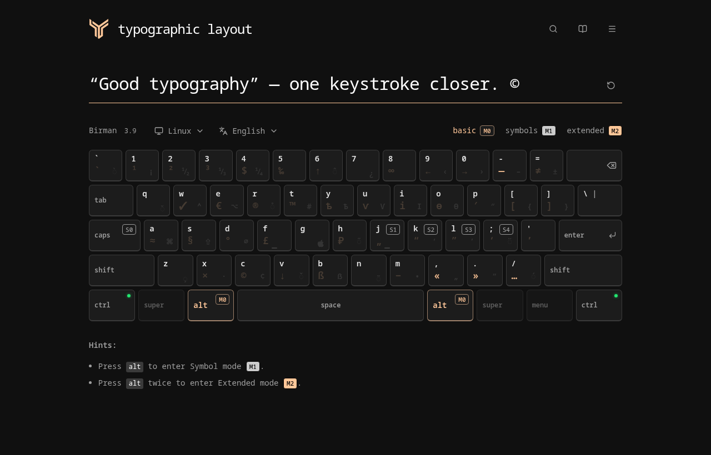

# Bố cục bàn phím kiểu chữ của Semyon Yushkevich

**[Mở bản demo](https://jussiemion.github.io/keyboard-layout-demo/)**

Thử ký hiệu kiểu chữ, dấu và chuyển ngôn ngữ ngay trong trình duyệt. Không cần
cài đặt hay tài khoản. Bạn có thể gõ bằng bàn phím thật hoặc nhấn các phím trên
màn hình.

<strong>Ngôn ngữ khác</strong>

<a href="../README.md">English</a> ·
<a href="README.ru.md">Русский</a> ·
<a href="README.pl.md">Polski</a> ·
<a href="README.pt.md">Português</a> ·
<a href="README.es.md">Español</a> ·
<a href="README.de.md">Deutsch</a> ·
<a href="README.fr.md">Français</a> ·
<a href="README.it.md">Italiano</a> ·
<a href="README.nl.md">Nederlands</a> ·
<a href="README.ro.md">Română</a> ·
<a href="README.ar.md">العربية</a> ·
<a href="README.he.md">עברית</a> ·
<a href="README.tr.md">Türkçe</a> ·
<a href="README.vi.md">Tiếng Việt</a>

> [!NOTE]
>
> Bố cục chủ yếu hướng đến các ngôn ngữ châu Âu. Việc hỗ trợ các ngôn ngữ khác,
> bao gồm tiếng Ả Rập, tiếng Do Thái, tiếng Thổ Nhĩ Kỳ và tiếng Việt, đang ở
> giai đoạn thử nghiệm: bộ ký tự và cách nhập có thể chưa đáp ứng đầy đủ các quy
> tắc của từng ngôn ngữ.

<picture>
  <source media="(prefers-color-scheme: dark)" srcset="assets/demo-dark.png">
  <source media="(prefers-color-scheme: light)" srcset="assets/demo-light.png">
  
</picture>

[Video: giao diện tối](assets/demo-dark.mp4) ·
[giao diện sáng](assets/demo-light.mp4) · MP4 · ≈ 26 s

> [!IMPORTANT]
>
> **Tắt bố cục kiểu chữ trong hệ điều hành trước khi thử demo.** Nó có thể chặn
> <kbd>Alt</kbd> hoặc <kbd>Caps Lock</kbd> trước trình duyệt. Cảnh báo chỉ xuất
> hiện sau tín hiệu rõ ràng; không có cảnh báo chưa chứng minh bố cục hệ thống
> đã tắt.

## Ký hiệu đầu tiên

Trong chuỗi phím, thả <kbd>Alt</kbd> trước khi nhấn phím tiếp theo. Dấu `+`
nghĩa là giữ các phím cùng lúc. Trên macOS, dùng <kbd>Option</kbd> thay cho
<kbd>Alt</kbd>. Tên chữ chỉ vị trí vật lý QWERTY, kể cả khi nhãn phím thay đổi
theo ngôn ngữ.

| Nhấn                                                 | Kết quả |  Chế độ  |
| ---------------------------------------------------- | :-----: | :------: |
| <kbd>Alt</kbd>, rồi <kbd>C</kbd>                     |   `©`   | **`M1`** |
| <kbd>Alt</kbd>, rồi <kbd>Alt</kbd>, rồi <kbd>C</kbd> |   `¢`   | **`M2`** |
| <kbd>Alt</kbd> + <kbd>-</kbd>                        |   `—`   | **`M0`** |
| <kbd>Alt</kbd> + <kbd>/</kbd>                        |   `…`   | **`M0`** |
| <kbd>Alt</kbd> + <kbd>,</kbd>                        |   `«`   | **`M0`** |
| <kbd>Alt</kbd> + <kbd>.</kbd>                        |   `»`   | **`M0`** |

**`M0`** là nhập thông thường; **`M1`** và **`M2`** chọn lớp ký hiệu cho lần
nhập tiếp theo. Không giới hạn thời gian giữa các lần nhấn. <kbd>Esc</kbd> hủy
ký hiệu hoặc dấu đang chờ. Các nút `M0`/`M1`/`M2` phía trên bàn phím cũng chọn
chế độ.

> [!TIP]
>
> **Menu → Hướng dẫn từng bước** cung cấp bài tập ngắn. Nếu đã biết
> [bố cục Birman](https://ilyabirman.ru/typography-layout/), ba bước giới thiệu
> sẽ được bỏ qua. Thử thách cuối với tất cả
> [ký hiệu Birman](https://ilyabirman.ru/typography-layout/) không bắt buộc. Nút
> hình sách mở bảng tra nhanh.

## Dấu

Bản đồ tiếng Việt dùng **XKB `vn(basic)`**, không phải Telex hay VNI. Sau khi gõ
và thả chữ, nhấn rồi thả <kbd>Shift</kbd> để chuyển qua các biến thể:
`d → đ → d`, `a → ă → â → á → …`. Chữ hoa được giữ nguyên. Dấu không tự động đặt
theo âm tiết; các vòng đầy đủ nằm trong tài liệu kỹ thuật. <kbd>Shift</kbd> giữ
cùng chữ vẫn có chức năng thông thường.

## Ngôn ngữ và cài đặt

|  Vị trí  | Nhấn                                | Kết quả                        |
| :------: | ----------------------------------- | ------------------------------ |
| **`S0`** | <kbd>Caps Lock</kbd>                | Chuyển giữa hai ngôn ngữ chính |
| **`S1`** | <kbd>Caps Lock</kbd> + <kbd>J</kbd> | Ngôn ngữ được gán 1            |
| **`S2`** | <kbd>Caps Lock</kbd> + <kbd>K</kbd> | Ngôn ngữ được gán 2            |
| **`S3`** | <kbd>Caps Lock</kbd> + <kbd>L</kbd> | Ngôn ngữ được gán 3            |
| **`S4`** | <kbd>Caps Lock</kbd> + <kbd>;</kbd> | Ngôn ngữ được gán 4            |

Gán sáu ngôn ngữ trong **Menu → Cài đặt**, rồi **lưu**. Hai lựa chọn **`S0`**
phải khác nhau; các vị trí khác có thể trùng. Đổi ngôn ngữ **giao diện** cũng
chọn bàn phím tương ứng. Bộ chọn **phía trên bàn phím** chỉ đổi bàn phím, không
đổi ngôn ngữ hệ điều hành hay văn bản đã nhập.

Giữ cả hai <kbd>Ctrl</kbd> rồi thả để bật hoặc tắt kiểu chữ. <kbd>Caps
Lock</kbd> vẫn chuyển ngôn ngữ.

Tất cả lựa chọn

Giao diện và tài liệu người dùng có **14 ngôn ngữ**, bàn phím có **24 lựa
chọn**. Các ngôn ngữ: Anh, Nga, Ba Lan, Pháp, Đức, Tây Ban Nha, Bồ Đào Nha, Ý,
Romania, Hebrew, Ả Rập, Thổ Nhĩ Kỳ, Việt và Hà Lan.

Các lựa chọn tiếng Anh cho Úc, Nigeria, New Zealand, Singapore, Hoa Kỳ và
Zimbabwe dùng chung bản đồ US QWERTY. Tiếng Tây Ban Nha Mexico dùng bản đồ Mỹ
Latinh; tiếng Bồ Đào Nha Brazil dùng ABNT2; tiếng Pháp Canada dùng Canada Pháp;
tiếng Đức Thụy Sĩ dùng QWERTZ Thụy Sĩ. Đây là lựa chọn bàn phím, không phải bản
dịch giao diện riêng.

- `en`
- `ru`
- `pl`
- `pt`
- `es`
- `de`
- `de-CH`
- `en-AU`
- `en-NG`
- `en-NZ`
- `en-SG`
- `en-US`
- `en-ZW`
- `es-MX`
- `fr`
- `fr-CA`
- `it`
- `nl`
- `pt-BR`
- `ro`
- `ar`
- `he`
- `tr`
- `vi`

[Tài liệu kỹ thuật bằng tiếng Anh](national-layouts.md)

## Tìm kiếm và giao diện

Kính lúp, <kbd>Ctrl</kbd> + <kbd>F</kbd> hoặc <kbd>Ctrl</kbd> + <kbd>K</kbd> mở
tìm kiếm ký hiệu. Tìm theo tên, ký tự, mã như `U+0024`, ngôn ngữ hoặc quốc gia.
Tìm kiếm hoạt động với 14 ngôn ngữ và chấp nhận lỗi gõ nhỏ.

Menu có giao diện sáng và tối. Linux/Windows/macOS thay đổi hình dạng bàn phím,
không đổi bố cục hệ điều hành.

Ứng dụng không lưu hay gửi văn bản luyện tập hoặc truy vấn tìm kiếm. Tùy chọn
được giữ trong trình duyệt; phông chữ đi kèm trang web.

## Phát triển và phản hồi

[Báo lỗi hoặc góp ý](https://github.com/jussiemion/keyboard-layout-demo/issues),
nêu hệ điều hành, trình duyệt, bản đồ đã chọn, bố cục hệ thống có bật hay không
và chuỗi phím chính xác.

[Tài liệu kỹ thuật bằng tiếng Anh](development.md) ·
[GitHub](https://github.com/jussiemion/keyboard-layout-demo)

Tác giả: **Semyon Yushkevich (jussiemion)**. Bản đồ ký hiệu dựa trên
[bố cục Ilya Birman 3.9](https://ilyabirman.ru/typography-layout/). Đóng góp gốc
của tác giả theo [MIT](../LICENSE);
[tài liệu bên thứ ba](../THIRD_PARTY_NOTICES.md) giữ điều kiện riêng.
